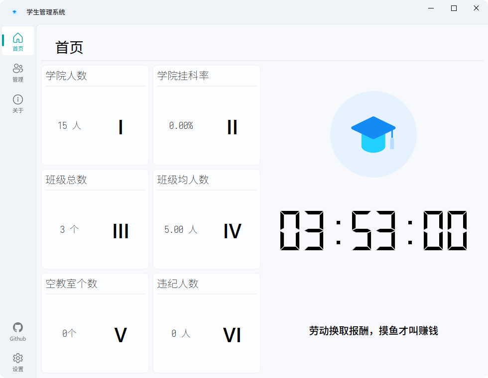
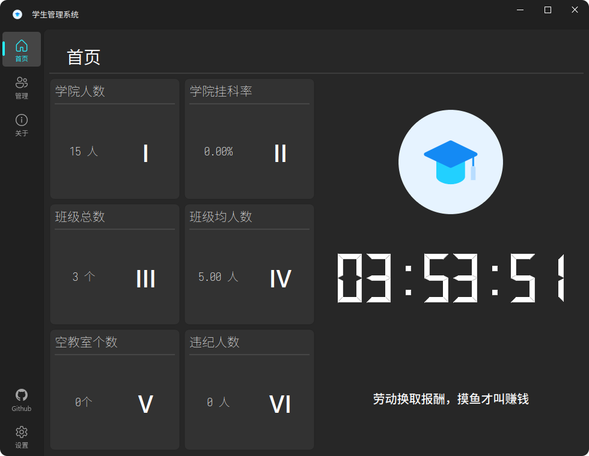

# Stuents Management System

> 这就是一个课程作业，请勿用于生产环境





## 前言

如果这个项目帮到了你完成作业或者~~毕业设计~~，不妨来点一个星星来支持我吧

有不懂的或者建议可以提 issue 或者 pr 哦

## 一个用python, pyqt, sqlite3实现的学生管理系统

实现了一个简单的学生系统，使用PyQt6作为应用的前端显示，通过Python和sqlite3数据库交互，实现数据的查看，增加，删除，查询，修改功能。此外，还实现了主题和主题色功能，以及通过xlwt实现了数据的导出为excel表格功能

## 所用开源项目

[PyQt6](https://www.riverbankcomputing.com/software/pyqt/)

[sqlite3](https://www.sqlite.org/index.html)

[pyodbc](https://github.com/mkleehammer/pyodbc)

[PyQt-Fluent-Widget](https://github.com/zhiyiYo/PyQt-Fluent-Widgets)

[xlwt](https://github.com/python-excel/xlwt)

## 开始

### Step-0 项目前置，没有就自己安装

- [Python3](https://www.python.org/)

- [venv](https://docs.python.org/zh-cn/3/library/venv.html)

- [pip](https://pypi.org/project/pip/)

> pip 建议自己换好全局源

### Step-1

**下面两个选一个下载就行**

#### 通过 git 下载项目

- 从 github 上克隆项目到本地文件夹。

```bash
git clone --single-branch https://github.com/HainanWinter-l/StuentsManagementSystem.git
```

#### 通过 github 自带办法下载

点击[仓库主页](https://github.com/HainanWinter-l/StuentsManagementSystem) 上的 `code`（绿色按钮），随后点击 `Download Zip`。最后解压即可。

### Step-2 新建虚拟环境

1. 使用[vscode](https://code.visualstudio.com/)（推荐）打开项目

2. 随后按 <kbd>ctrl</kbd> + <kbd>`</kbd> 打开内置终端

3. 输入 `python -m venv venv` 来在目录文件下创建虚拟环境（接下来的东西都在虚拟环境中运行）


### Step-3 补全项目依赖并运行项目

```bash
# 更新 pip 版本
pip install --upgrade pip
# 安装项目的依赖
pip install -r requirements.txt
# 运行代码
python -u Program.py
```

### Step-4 安装 pyqt6-tools 用于开发

由于版本的更新，现在已经无法使用 `pip` 来直接安装 `pyqt6-tools`。

#### 以下是现在的安装办法

1. 自行在[官网](https://pypi.org/project/pyqt6-plugins/)或参考[博客](https://www.cnblogs.com/littlecc/p/18337842)来安装 `pyqt6_plugins`

2. 使用 `pip` 安装 `pyqt6-tools`

```bash
pip install pyqt6-tools
```

### Step-5 打包成可执行文件（Linux）或msi安装包（Windows）\[可选项\]

> 请确保你的 C 语言编译器（gcc, clang, cl之类的）已经存在系统环境变量中

> Linux 还下需要先用包管理器（pacman, apt, dnf, yum之类的）安装 patchelf

```bash
# 安装 nuitka
pip install nuitka
# 执行以下命令
nuitka --standalone --onefile --enable-plugin=pyqt6 --include-qt-plugins=all --windows-icon-from-ico=./Resource/icon/icon.ico --disable-console Program.py
```

命令解释如下

```bash
nuitka \
  --standalone \          # 生成独立文件夹
  --onefile \             # 单文件模式（Windows推荐，Linux可选）
  --enable-plugin=pyqt6 \ # 启用 PyQt6 插件支持
  --include-qt-plugins=all \  # 包含所有 Qt 插件（如图形格式、平台插件）
  --windows-icon-from-ico=./Resource/icon/icon.ico \     # Windows 图标（Linux忽略）
  --disable-console \     # 隐藏控制台（仅GUI程序）
  Program.py
```

> Linux 用户还可以通过以下命令清除软件构建缓存

```bash
# 先列出所有文件，筛选出有 Program 的，然后在去掉有 py 的，然后传参删除
ls | grep "Program" | grep -v "py" | xargs rm -r
```

## 开源协议

MIT